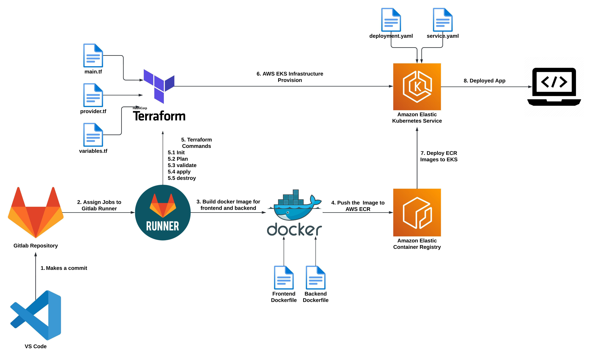

# RedAcre_Solution


## Getting started
### Probelm Statement
- Task 1 - Dockerize the Application

The first task is to dockerise this application - as part of this task you will have to get the application to work with Docker and Docker Compose. You can expsoe the frontend using NGINX or HaProxy The React container should also perform npm build every time it is built. Hint/Optional - Create 3 separate containers. 1 for the backend, 2nd for the proxy and 3rd for the react frontend. The only strict requirement is that the application should spin up with docker-compose up --build command

- Task 2 - Deploy on Cloud

Next step is to deploy this application on AWS At this point the application is already containerized, so you could deploy it to services which take an advantage of that fact, example ECS Fargate/EKS. The deliverable of this task is infrastructure as a code so we are interested in seeing the terraform/ansible files. We don't need to see the environment running but we will use your deliverable to try it out, so make sure it is easy for us to configure credentials etc.

- Task 3 - Get it to work with Kubernetes

Next step is completely separate from step 2. Go back to the application you built in Task 1 and get it to work with Kubernetes. Separate out the two containers into separate pods, communicate between the two containers, add a load balancer (or equivalent), expose the final App over port 80 to the final user (and any other tertiary tasks you might need to do) Add all the deployments, services and volume (if any) yaml files in the repo. The only hard-requirement is to get the app to work with minikube.


## Pre-Requisites
- GitLab account with Shared Runner configured inorder to run the GitLab CI/CD pipelines
- AWS account for utilizing resources
- IAM user credentials (Administrator policy attached)
- GitLab Username and PAT Token(All scope/custom scope)


## Architecture


## Test Locally

Inorder to test locally, Install docker, aws cli, terraform, kubectl

- configure aws cli
- Test the Docker Build
  - make sure docker is installed and available for use
  - navigate to sys-stats and api folder and build docker image
  - now run the docker-compose file

- Test the terraform
  - make sure terraform is installed and available for use
  - naviage to terraform folder and run following commands
```
terraform init

terraform validate

terraform plan

terraform apply

```
- This will provision the infrastructure in aws
- Upload the images to ECR
- Use kubectl to deploy to EKS from ECR

# GitLab CI/CD 


## Variables

DOCKER_HOST: The host where Docker is running.

AWS_DEFAULT_REGION: The region where AWS services are running.

DOCKER_REGISTRY: The URL of the Docker registry where the images will be pushed.

REGISTRY_NAME_FRONTEND: The name of the Docker image for the frontend service.

REGISTRY_NAME_BACKEND: The name of the Docker image for the backend service.

TF_DIR: The directory where the Terraform code is located.

STATE_NAME: The name of the Terraform state.

ADDRESS: The URL of the GitLab API for the Terraform state.

## Configurations

AWS_ACCESS_KEY_ID: IAM user access key ID

AWS_SECRET_ACCESS_KEY: IAM user access key secret

Username: Username of GitLab account

TOKEN: PAT token of GitLab account

## Steps

For this project the CI/CD pipeline was build using GitLab. This GitLab CI/CD pipeline is designed to build and deploy a containerized application to a Kubernetes cluster. It consists of four stages, each with its own specific function:

### Stage1: docker_build

The docker_build stage is responsible for building the Docker images for the frontend and backend services and pushing them to an Amazon Elastic Container Registry (ECR). The stage consists of two jobs, build_frontend and build_backend, each of which builds the Docker image for the corresponding service, tags it with the ECR registry and image name, and then pushes it to the ECR repository.

The build_frontend and build_backend jobs use the amazon/aws-cli Docker image as the base image and have the docker:dind service running to provide access to the Docker daemon during the build process. Before the build process begins, the necessary dependencies such as the Docker and AWS CLI are installed, and the credentials are retrieved using the aws ecr get-login-password command.

Finally, the built Docker images are pushed to the ECR registry using the docker push command, with the ECR registry and image name provided through the environment variables $DOCKER_REGISTRY and $REGISTRY_NAME_FRONTEND or $REGISTRY_NAME_BACKEND.\

### Stage2: docker_compose

 The docker_compose stage in this pipeline is responsible for creating a Docker Compose environment for the project. This environment is built using the images created in the docker_build stage, which creates two Docker images for the project's frontend and backend services, respectively.

The stage is defined to run after the docker_build stage, as it depends on the images created by that stage. The stage uses the amazon/aws-cli Docker image as the base image and uses docker:dind as a service for running Docker inside Docker.

### Stage3: iac_terraform

The iac_terraform stage in this pipeline usesTerraform to manage the infrastructure as code (IAC) for the Kubernetes cluster.
The stage uses a lightweight Terraform Docker image to perform the following tasks:
- It installs the Terraform binary and verifies its version using the terraform --version command.
- It sets up the backend configuration for Terraform, which is configured to store the state file remotely using GitLab's API (using the export GITLAB_ACCESS_TOKEN command).
- It initializes Terraform by running terraform init with the necessary backend configuration options.
- It validates the Terraform configuration files using the terraform validate command.
- It generates an execution plan for the Terraform changes using the terraform plan command. This step shows what changes will be applied to the infrastructure and allows you to review them before applying them.
- After the plan, it will run the terraform apply which will provision the infrastructure in aws.
- Finally, it caches the Terraform initialization state files in GitLab's cache, so that subsequent pipeline runs can reuse the previously downloaded dependencies and speed up the pipeline.

By using Terraform, this pipeline automates the creation and management of the infrastructure for the Kubernetes cluster, making it more reliable and easier to scale.

### Stage4: deploy_k8s

The deploy_k8s stage is responsible for deploying the application to a Kubernetes cluster. The stage includes the following tasks:
- It defines an image with the necessary tools, including the awscli and kubectl commands, and also sets up the Docker-in-Docker (DinD) service.
- Before running the actual deployment, the script performs some preparations, such as installing the awscli and configuring the Kubernetes cluster credentials using the aws eks update-kubeconfig and kubectl config use-context commands.
- The script then applies the Kubernetes deployment and service files for both the frontend and backend components using the kubectl apply command.
- Finally, the script verifies that the services are running using the kubectl get services command.

Also, the when: manual option means that this stage needs to be triggered manually and will not run automatically. This is to ensure that the deployment only occurs when intended and to prevent accidental deployments.

## Authors and acknowledgment
Akhil Anil

DevOps Engineer, UST

akhilmanil0@gmail.com

+91-8139076161
